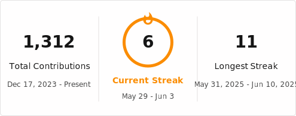

  

### 🛠️ I can use...

### 📖 I am learning...

### 🚀 I am interested in using...

## 📊 GitHub Stats

  
  
  

 

  <picture>
    <source srcset="https://raw.githubusercontent.com/eitaar/eitaar/output/github-contribution-grid-snake.svg" media="(prefers-color-scheme: light)" type="image/svg+xml"/>
    <source srcset="https://raw.githubusercontent.com/eitaar/eitaar/output/github-contribution-grid-snake-dark.svg" media="(prefers-color-scheme: dark)" type="image/svg+xml"/>
    
  </picture>

---
